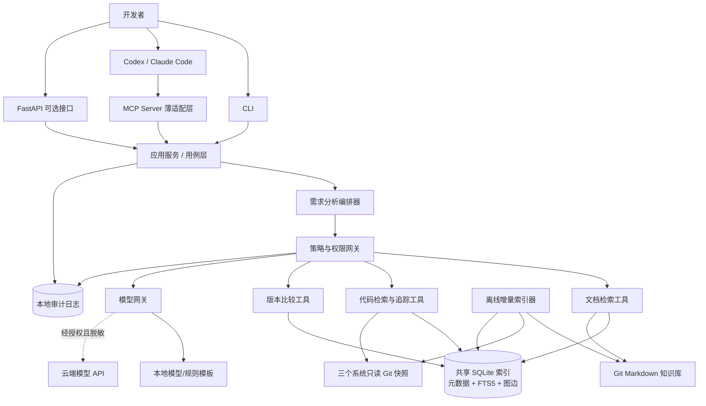

# 系统架构与技术选型

## 1. 架构结论

MVP 采用模块化单体和一个可审计的需求分析编排器。编排器不是“全能自治 Agent”，而是执行显式状态机：模型负责意图理解、查询改写、证据综合与报告表达；确定性工具负责搜索、解析、解析度量、版本比较、路径校验和引用生成。

暂不采用多个专业 Agent。多 Agent 会增加上下文复制、结论冲突、延迟和审计难度，而 MVP 的检索、追踪、核验可由专业工具模块分工。只有出现可独立并行、可单独验收的任务（例如不同仓库的超大范围分析）且评测显示收益后，才引入受控 worker。

## 2. 完整架构

`APP` 是唯一业务能力实现，CLI、FastAPI、MCP 都只是适配器；这避免三套入口各自实现索引和规则。索引器单写、多客户端只读查询。

## 3. Agent 如何工作

编排状态至少包含：`request`、`scope`、`terms`、`queries`、`evidence_ids`、`confirmed_edges`、`inferred_edges`、`conflicts`、`open_questions`、`coverage` 和 `report_draft`。每一步只传证据 ID 和紧凑摘要；原文按需读取，避免把长代码链塞入对话。

工具选择以规则为骨架：出现接口编号先精确查接口表和代码；出现类/方法先查符号索引；业务描述先检索术语与历史需求；只有证据不足时才扩展查询。模型可以建议下一步，但不能绕过策略网关、伪造工具结果或把推断升级为事实。

长调用链采用外部化状态：调用图节点/边存入 SQLite，边携带来源、行号、解析器、commit 和置信类别；编排器按 frontier 逐层扩展、设置深度/节点/时间预算、去重并保存检查点。最终报告从证据图生成，而不是依赖模型记忆全部链路。

## 4. 技术选型评估

| 技术 | MVP 决策 | 优点 | 局限/替代 | 引入时机 |
|---|---|---|---|---|
| Python 3.11+ | 必选 | AI/MCP/文本生态成熟，适合个人学习 | 深度 Java 语义分析可调用 JVM sidecar | 从第一天 |
| FastAPI | 可选薄层 | 类型校验、OpenAPI、易于本地 API | 仅 CLI/MCP 时可不启动；替代 Flask/纯 stdio | 第 3 周或需要 HTTP 时 |
| MCP Python SDK | 必选但后置 | Codex/Claude 共用标准工具；支持 stdio、Streamable HTTP | SDK/规范仍演进，需锁版本和契约测试 | 核心服务稳定后，第 3 周 |
| SQLite | 必选 | 单文件、事务、零服务运维 | 多写者/超大规模不足；可迁 PostgreSQL | MVP 起 |
| SQLite FTS5 | 必选 | 内建全文检索、BM25、snippet | 中文分词较弱；用字符 n-gram/预分词补足 | MVP 起 |
| Git Markdown | 必选 | 可审阅、diff、版本和责任明确 | 二进制文档需保留原件并派生文本 | MVP 起 |
| 大模型 API | 可插拔 | 擅长需求理解和综合表达 | 不可信且有数据边界；可换本地模型/模板 | 获授权后；无授权用模拟数据 |
| LangGraph | 暂缓 | 显式状态、检查点、暂停恢复 | MVP 可用普通 Python 状态机，依赖与学习成本更低 | 流程分支、恢复、人审复杂后 |
| ripgrep | 必选 | 快速、透明，适合第一轮候选召回 | 不理解语义 | MVP 起 |
| Tree-sitter Java | 必选 | 容错、结构化、适合方法/注解/调用表达式抽取 | 不完整解决类型与动态分派 | 第 2 周 |
| JavaParser + Symbol Solver | 条件引入 | 更强类型/符号解析 | JVM 集成、依赖与构建上下文复杂 | Tree-sitter 精度达不到门槛时 |
| 向量库 | 暂缓 | 语义召回 | 嵌入泄露、模型版本、重建与评估成本 | FTS5 漏检被量化后；优先 SQLite 扩展/本地 FAISS |
| Elasticsearch/RAGFlow | 不引入 | 功能全面 | 对个人电脑和小规模语料过重 | 团队化、规模和运维需求明确后 |

SQLite FTS5 官方支持全文索引、BM25 排序和片段提取；MCP Python SDK 当前稳定文档覆盖工具/资源/提示词以及 stdio、Streamable HTTP、SSE；Tree-sitter 提供多语言结构化解析。这些能力足以支撑轻量 MVP，参考资料见文末。

## 5. 确定性程序与模型边界

确定性程序完成：文件白名单、hash/commit、格式转换、切分、全文搜索、AST/注解/调用表达式抽取、行号、图遍历、diff、排序、引用校验、敏感信息扫描、预算与审计。

模型完成：需求术语归一化、查询扩展、候选证据语义判断、冲突解释、风险/测试启发、报告组织。模型输出必须引用现有 `evidence_id`；无证据只能进入推断或待确认区。

## 6. 避免重复建设通用 Coding Agent

BankDev Agent 不实现编辑器、shell agent、Git 操作、通用补丁生成或 IDE。它提供领域数据平面：统一索引、跨仓库实体关系、银行术语、证据分级和只读 MCP 工具。Codex/Claude Code 继续负责任务交互和通用代码工作；是否修改代码必须由客户端和人工审批控制。

## 7. 参考资料

- [MCP Python SDK](https://py.sdk.modelcontextprotocol.io/)
- [SQLite FTS5](https://www.sqlite.org/fts5.html)
- [Tree-sitter 使用解析器](https://tree-sitter.github.io/tree-sitter/using-parsers/)
- [LangGraph 官方学习资料](https://docs.langchain.com/oss/python/learn)
