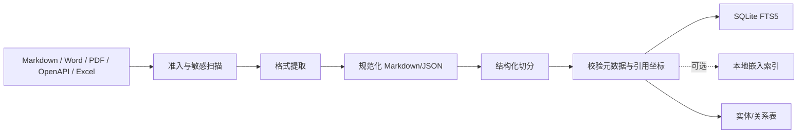

# 银行业务知识库设计

## 1. Git 目录结构

```text
knowledge/
├── README.md
├── glossary/                 # 受控术语、缩写、别名
├── requirements/             # 按业务域/需求编号/版本
│   └── <domain>/<req-id>/v001.md
├── interfaces/               # 标准化接口定义及映射
│   └── <system>/<interface-id>/v001.md
├── systems/
│   ├── core/
│   ├── wrapper/
│   └── dfbm/
├── decisions/                # ADR：YYYY-NNN-title.md
├── solutions/                # 历史技术方案
├── mappings/                 # 跨系统字段、错误码和接口映射
├── runbooks/                 # 脱敏排障经验
├── sources/                  # 原始文件或其受控引用，不直接检索
└── generated/                # 可重建派生文本；禁止人工编辑
```

文件名稳定、使用小写 ASCII 标识；中文标题放在 front matter。每份可检索文档至少包含：

```yaml
---
doc_id: REQ-TD-001
title: 定期利息试算改造（示例，不代表真实资料）
doc_type: requirement
system: [dfbm, wrapper]
domain: deposit
interfaces: []
version: v001
status: effective
effective_from: 2026-01-01
supersedes: null
source_path: sources/example.docx
source_sha256: ...
confidentiality: internal
owner: TBD
last_reviewed: 2026-01-01
---
```

变更走 Git commit/PR；`generated/` 由索引器基于源 hash 重建。旧版本不覆盖，标记 `superseded` 和 `supersedes/superseded_by`。默认检索只返回有效版本，但允许显式时点查询。

## 2. 文档处理流水线



- Markdown：保留原始标题层级、表格、代码块和相对链接。
- Word：提取段落、标题样式、表格、页/段落锚点；原文件 hash 与派生 Markdown 一一对应。
- PDF：优先文本层；扫描件 OCR 必须标记 `extraction_method=ocr` 和较低可信度，并保留页码/坐标。
- OpenAPI/JSON/YAML：按 operation 拆分，字段保持 JSON Pointer；接口表格转为结构化字段记录。
- Excel：按 sheet/表头区域拆分，记录单元格范围；公式与展示值分别保存。

切分遵循语义边界而非固定字符数：`文档 → 章节 → 子章节/接口/表格`。建议正文块 500–1,200 中文字，重叠只包含父标题和少量上下文；表格不按行任意截断。每块保存 `chunk_id`、标题路径、业务域、系统、接口号、版本、有效期、源文件、页码/行号/单元格、hash 和访问级别。

## 3. 检索方案

MVP 使用三路候选并统一重排：

1. 精确检索：接口编号、错误码、类名、字段名，最高权重。
2. SQLite FTS5/BM25：正文、标题、别名和元数据过滤；中文使用归一化、业务词典以及可测试的字符 bigram/trigram 派生列，避免依赖默认空格分词。
3. 关系扩展：从接口、系统、需求、字段等实体沿已确认关系扩一跳。

结果用 Reciprocal Rank Fusion 或简单可解释权重合并，保留每路原分数与命中理由。初期不默认向量检索；当回归集证明同义表达召回不足时，才增加本地嵌入，并记录 embedding 模型、版本、向量来源和重建状态。向量结果不能提升资料权威性。

## 4. 增量索引与版本一致性

索引清单保存 `source_id + git_commit + path + blob_hash + parser_version + schema_version`。扫描时：新增/变更文件重切分，删除文件软删除，未变 hash 跳过。一次变更在临时表完成，校验后事务切换 `index_snapshot_id`，查询始终看到一致快照。

版本选择顺序：明确指定 commit/日期 > `status=effective` 且有效期匹配 > 最新已审核版。多个有效版本冲突时不自动合并，返回冲突。代码索引与文档索引在报告中分别显示 snapshot/commit，避免“新文档 + 旧代码”被误认为一致。

## 5. 权威性与冲突处理

“代码是真实行为”也不是绝对规则：运行配置、数据库数据、远端服务和反射可能改变行为。系统按证据类型呈现，而不是强行选赢家：

| 等级 | 证据 | 可支持的结论 |
|---|---|---|
| A | 同 commit 的代码/配置/接口契约，解析器可定位 | 静态已确认事实 |
| B | 已生效且审核的需求/接口文档 | 文档规定事实 |
| C | 脱敏运行日志/追踪 | 特定请求的运行事实 |
| D | 历史方案/经验 | 背景或推断依据 |
| E | 模型推理 | 仅推断/待确认 |

冲突记录包含双方 `evidence_id`、冲突字段、版本、影响和建议核验人。报告引用格式统一为 `repo@commit:path#Lx-Ly`、`doc_id@version:heading/page`；UI/客户端可把它转为可点击链接。发布报告前执行引用存在性、行号范围、hash 和访问权限校验。

## 6. 维护职责

- 文档 owner 负责有效状态和业务解释。
- 仓库 owner 负责只读快照授权。
- 索引器只派生，不修改源资料。
- 每次索引输出新增、修改、删除、解析失败、冲突和敏感项清单；解析失败不能静默跳过。

参考：[SQLite FTS5 官方文档](https://www.sqlite.org/fts5.html)。
