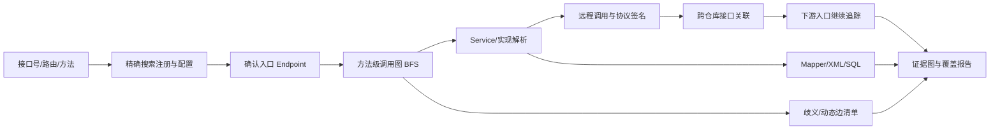

# 跨系统 Java 代码分析设计

## 1. 分层分析策略

代码分析必须从廉价、可解释的方法逐步升级：

1. `rg` 精确/正则召回接口号、路由、类、方法、配置键、SQL ID。
2. Tree-sitter 提取 package/import、类型、方法、注解、调用表达式、字段访问和源码范围。
3. 框架识别器解析 Spring MVC 注解、Bean 注入、Feign/RestTemplate/WebClient 等已配置模式、MyBatis Mapper/XML namespace 和 statement。
4. JavaParser + Symbol Solver 仅在需要跨文件类型解析且项目构建上下文可得时启用；失败要返回 unresolved，不以名称相似冒充解析成功。
5. 对动态行为生成候选边和核验建议；可用脱敏运行证据提升为“运行时观察”，但不改写静态事实。

Tree-sitter 适合快速结构化抽取和容错，JavaParser Symbol Solver 适合更深的 Java 符号解析；二者并非二选一。官方资料：[Tree-sitter](https://tree-sitter.github.io/tree-sitter/using-parsers/)、[JavaParser](https://github.com/javaparser/javaparser)。

## 2. 统一代码模型

核心实体：`Repository`、`Snapshot`、`File`、`Type`、`Method`、`Endpoint`、`ExternalOperation`、`ConfigKey`、`MapperStatement`、`Table`、`Field`。核心关系：`DECLARES`、`CALLS`、`IMPLEMENTS`、`INJECTS`、`EXPOSES`、`INVOKES_REMOTE`、`MAPS_TO_SQL`、`READS/WRITES`、`TRANSFORMS`。

每条关系必须记录：

```json
{
  "edge_id": "edge:sha256...",
  "from": "method:...",
  "to": "method-or-unresolved:...",
  "kind": "CALLS",
  "classification": "confirmed_static",
  "confidence": 1.0,
  "evidence": [{"repo":"dfbm","commit":"...","path":"...","start_line":10,"end_line":12}],
  "extractor": "spring-mvc-rule@1",
  "reason": "direct resolved invocation",
  "alternatives": []
}
```

`classification` 只允许：`confirmed_static`（解析或明确配置确认）、`observed_runtime`（脱敏追踪/日志观察）、`inferred`（基于证据推断）、`unresolved`。置信度不能替代类别。

## 3. 接口追踪流程



跨仓库关联不靠仓库名猜测，而用规范化“连接签名”：协议、HTTP method/path 或 RPC service/method、接口编号、目标服务配置键、请求/响应 schema 指纹。只有强键一致才建立确认边；名称/字段相似只生成候选。

## 4. Spring、MyBatis 与复杂场景

- Controller/接口注册：合并类级与方法级映射，解析常量；无法求值的 SpEL/占位符保留表达式和配置键。
- Service/多实现：结合声明类型、限定符、Bean 名、Profile 和配置；仍有多个实现时返回所有候选，不任意选择。
- RPC/HTTP：识别声明式客户端和显式客户端调用，记录 URL/path 来源；运行时服务发现不视为已解析具体实例。
- MyBatis：关联 Mapper 接口方法、XML namespace/id、parameter/result map、动态 SQL 标签和表名。`${}`、动态表名、provider 方法标为高风险动态点。
- DTO 映射：提取构造器、setter/getter、MapStruct 注解/生成源引用、手工转换；字段关系带源/目标位置。
- 反射、SPI、脚本、配置路由：记录触发点、配置键和候选目标，标记 `unresolved`；需要配置快照或运行证据。
- Lombok/生成代码：优先读取生成源码或构建元数据；缺失时显式说明解析能力边界。

## 5. 图遍历与上下文控制

采用带预算的 BFS/最佳优先搜索，默认深度 8、节点 200、单仓库/跨仓库超时可配置。按已确认边优先、远程边/数据库边次之、推断边最后。遇循环用稳定符号 ID 去重。每层保存 frontier 和覆盖统计；结果可断点续跑，不将全部源码发送给模型。

## 6. Git 感知索引

索引键为 `repo_id + commit_sha`。文件以 Git blob hash 增量处理；未变 blob 复用 AST 派生物，但符号解析受依赖变化影响时重算相关边。保存构建描述符 hash、源码集/classpath 解析状态和 parser 版本。报告固定 snapshot，不允许分析中途随工作树漂移。

代码与文档可共用 SQLite 的元数据和 FTS 层，但代码有独立的 symbol/edge 表和生命周期；无需 MVP 即引入图数据库。

## 7. 统一工具接口

内部 Python 端口（与 CLI/API/MCP 解耦）：

```text
CodeSearch.search(query, repos, snapshot, symbol_kinds, limit) -> SearchResult
CodeGraph.trace(start_ref, direction, max_depth, edge_kinds, budget) -> TraceResult
CodeGraph.impact(change_refs, max_depth, include_tests) -> ImpactResult
InterfaceCatalog.get(interface_id, snapshot) -> InterfaceResult
Snapshot.compare(left, right, scope) -> DiffResult
```

通用返回包含 `request_id`、`snapshot_ids`、`items/graph`、`evidence`、`unresolved`、`warnings`、`coverage`、`timing_ms` 和 `truncated`。输入路径只能是登记的 `repo_id`，不能接受任意绝对路径。

## 8. 已知限制

静态分析无法可靠确认运行期条件分支、远程服务实际路由、数据库内容驱动、反射目标和部署配置。工具必须报告“能证明什么、不能证明什么、下一步需要哪项证据”，而不是给出虚假的完整调用链。
