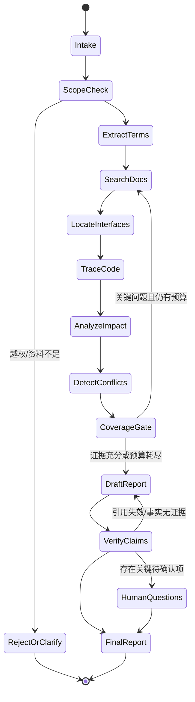

# 需求分析 Agent 工作流

## 1. 设计原则

MVP 是单编排器、显式步骤、有限循环的工作流。模型不能直接访问文件系统；它只能通过范围受控的工具取得带证据 ID 的数据。每个阶段都有输入/输出 schema、预算、失败状态和审计事件。

## 2. 完整流程



### 阶段输入输出

1. 需求理解：提取目标、非目标、业务动作、对象、约束、验收条件；输出结构化 `RequirementFrame`，不添加原文没有的规则。
2. 术语识别：用受控词典归一化别名，保留原词。
3. 文档检索：精确编号、FTS 和关系扩展；保存查询、命中与未命中。
4. 接口/代码定位：先入口候选，再按证据追踪；不默认三层必经。
5. 影响分析：从变更实体反向/正向遍历，区分直接影响、传递影响、候选影响。
6. 规则与兼容性：比较请求/响应、字段、错误码、配置、数据结构和版本；模型只综合工具结果。
7. 方案与测试：每条建议绑定事实依据或清楚标为设计建议。
8. 证据检查：逐条 claim 校验引用、snapshot、类型和可访问性；无依据事实降级为推断/问题或删除。

## 3. 核心状态

```json
{
  "analysis_id": "uuid",
  "requirement": {"source":"user", "text_hash":"..."},
  "scope": {"repo_ids":[], "doc_collections":[], "snapshots":[]},
  "terms": [],
  "evidence_ledger": {},
  "graph": {"nodes":[], "edges":[]},
  "claims": [],
  "conflicts": [],
  "open_questions": [],
  "budgets": {"tool_calls":30, "graph_nodes":200, "elapsed_seconds":300},
  "coverage": {}
}
```

`claims[]` 至少包含 `text`、`type=fact|inference|question|recommendation`、`evidence_ids`、`confidence_reason`。只有 `fact` 强制要求一个或多个可验证证据；推断必须陈述推理链和反证条件。

## 4. 报告模板

最终报告固定包含：

1. 分析范围与快照（仓库 commit、知识库版本、时间、限制）。
2. 需求摘要与明确非目标。
3. 当前实现（已确认事实）。
4. 跨系统调用关系图，边使用实线=静态确认、粗线=运行观察、虚线=推断、断点=未解析。
5. 受影响接口、类/方法、配置、表/字段；每项带出处。
6. 业务规则与兼容性风险。
7. 建议开发方案；说明是建议而不是现状事实。
8. 测试场景（前置条件、输入维度、预期、依据）。
9. 证据冲突、分析覆盖和工具限制。
10. 待人工确认问题。
11. 证据目录（可点击文档/代码位置）。

## 5. 反幻觉门禁

- 未出现在符号索引或证据中的类、接口、字段不得进入“已确认”。
- 引用必须由程序生成，模型不得手写路径和行号。
- 报告生成后从文本抽取实体，与 evidence ledger 反查；未绑定实体阻止发布或降级。
- 工具 `truncated=true`、解析失败和动态分派必须进入限制章节。
- “未找到”仅表示在给定 scope/snapshot/query/budget 内未找到，不等于不存在。

## 6. LangGraph 引入门槛

MVP 用普通 Python 状态机和 SQLite checkpoint 足够。满足任一条件再评估 LangGraph：需要长任务可靠恢复、人审中断后继续、分支/重试数量显著增长，或并行 worker 难以维护。LangGraph 官方强调显式图状态、节点检查点和 human-in-the-loop，这与未来需求匹配，但不是 MVP 的前置依赖：[官方资料](https://docs.langchain.com/oss/python/learn)。
