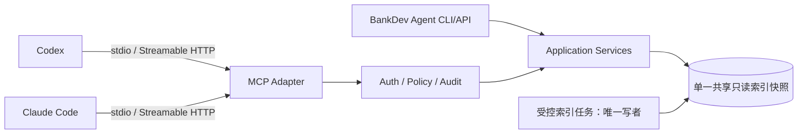

# MCP 工具服务与客户端集成

## 1. 分工与部署

MCP Server 是应用服务的薄适配器：负责协议、输入输出 schema、会话身份、超时和错误映射；检索、索引、图分析与策略都在共享应用核心实现。Agent 主程序负责任务拆解、工具编排、证据核验和报告生成。MCP 工具本身不调用大模型，保证可复用、可测试。

本机 MVP 默认 stdio，天然限制网络暴露；团队化后使用 localhost/内网 Streamable HTTP，加 TLS、身份认证和 scope。MCP Python SDK 当前稳定文档支持工具/资源/提示词及 stdio、Streamable HTTP、SSE；实现时锁定 SDK 版本并做客户端契约测试：[官方 SDK](https://py.sdk.modelcontextprotocol.io/)。



Codex、Claude Code 和本项目指向同一个配置化服务/数据库；客户端不拥有索引逻辑。SQLite 使用单写者索引任务、查询连接只读模式，更新后原子切换 snapshot。

## 2. MVP 工具集

不为每个底层动作暴露工具。MVP 只提供四个聚合能力：

### `search_knowledge`

同时搜索业务文档、接口目录和必要的代码文本，可用 `kinds` 限定。

```json
{
  "query":"string",
  "kinds":["document","interface","code"],
  "systems":["dfbm"],
  "snapshot":"optional",
  "limit":20
}
```

### `get_interface`

输入 `interface_id` 和可选 snapshot，返回规范、版本、字段、映射、实现位置、冲突与证据。它合并候选的 `get_interface_definition` 与简单版本查询，避免碎片工具。

### `trace_interface`

```json
{
  "interface_ref":"接口号、路由或代码符号",
  "repo_ids":["registered-id"],
  "direction":"downstream",
  "max_depth":8,
  "include_inferred":false,
  "snapshot":"optional"
}
```

返回 typed graph、confirmed/observed/inferred/unresolved 分组、截断原因、覆盖率和证据。

### `analyze_impact`

输入接口/符号/字段引用和变更描述，返回直接影响、传递候选、数据结构、测试入口、冲突与未知点。`generate_test_scenarios` 暂作为 Agent 报告步骤，不单独开放；因为它需要需求上下文和模型综合，而不是底层确定性工具。`compare_api_versions` 先作为 `get_interface(left/right)` 的应用操作，出现高频需求后再单独公开。

## 3. 统一响应封装

```json
{
  "schema_version":"1.0",
  "request_id":"uuid",
  "status":"ok|partial|error",
  "snapshot_ids":{"docs":"...","repos":{"dfbm":"commit"}},
  "data":{},
  "evidence":[{
    "evidence_id":"ev:...",
    "kind":"code|document|runtime",
    "uri":"bankdev://repo/dfbm/commit/path#L10-L20",
    "display_path":"path#L10-L20",
    "excerpt":"bounded excerpt",
    "classification":"confirmed_static"
  }],
  "warnings":[],
  "unresolved":[],
  "coverage":{"truncated":false,"reason":null},
  "timing_ms":42
}
```

错误使用稳定代码：`INVALID_ARGUMENT`、`OUT_OF_SCOPE`、`SNAPSHOT_NOT_FOUND`、`INDEX_STALE`、`TIMEOUT`、`PARSE_PARTIAL`、`PERMISSION_DENIED`、`INTERNAL_ERROR`。错误不得泄露禁区路径或秘密。

## 4. 超时、权限与错误处理

- 每个工具有 wall-clock、结果数、文件数、图节点数和 excerpt 字节预算；达到预算返回 `partial`，不伪装完整。
- Server 从会话身份推导授权 repo/collection；请求只能给逻辑 ID，服务端映射规范路径并校验 `realpath` 位于白名单根目录，拒绝 `..`、软链接逃逸和任意 glob。
- 取消信号向下传递；单文件解析失败隔离，形成 warnings。
- 输入/输出做 schema 校验；日志记录参数摘要/hash、调用者、策略结果、snapshot、耗时与错误，不记录完整敏感正文。
- stdio 场景依赖本机账户边界；HTTP 场景再增加 OAuth/短期令牌、TLS、速率限制。认证在协议边界和工具处理器双重校验。

## 5. 未来写操作与审批

未来可增加“生成补丁”和“运行测试”，但分为 plan/read、prepare、execute 三阶段：

1. 工具先返回精确目标、命令、diff、影响与风险，不执行。
2. 人工在客户端确认一次性 action token，token 绑定调用者、仓库、commit、命令和过期时间。
3. 在隔离 worktree/容器执行，限制网络、CPU、时间和可写路径；输出审计记录。

生产数据库、真实交易、凭证读取、直接 push/merge 默认永久禁止；审批不能通过提示词文本伪造。
