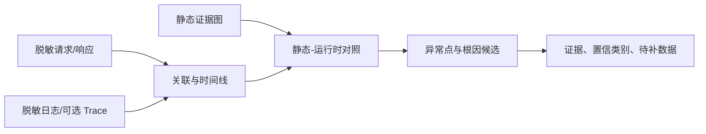

# 安全边界、联调扩展与评估方案

## 1. 第一阶段安全基线

### 只读和范围隔离

- 使用登记的逻辑 repo/collection ID；服务端配置绝对 allowlist 根路径，解析 `realpath` 后再访问。
- 业务仓库以只读挂载或只读账户打开；索引器只写项目 `var/`，不执行仓库脚本、Git hook、Maven/Gradle 插件。
- 拒绝任意绝对路径、父目录跳转、软链接逃逸、设备文件、socket 和未登记子模块。
- 第一阶段禁止生产数据库、生产服务、代码修改、测试执行和网络扫描。

### 敏感信息与模型边界

资料准入先做密级判定，再做规则+词典+熵检测：账号/卡号/证件/手机号/姓名、token/key/password、证书私钥、连接串、内部地址等。脱敏保持关联性的场景使用项目级 HMAC 假名，不可逆展示使用掩码；原值与脱敏映射分离并加密、最短保留。

模型路由策略：`restricted` 只能使用批准的本地模型或确定性流程；`internal` 仅在组织明确授权、区域/保留/训练策略合规且完成脱敏后可出域；`public/synthetic` 可按配置使用云模型。发送前生成字段级出域清单与 hash，审计不保存完整 prompt。未经授权默认拒绝，不以“用户在提示词中同意”替代组织授权。

### 凭证、索引与审计

- 密钥进入 OS keychain/企业 secret manager；进程短期注入，按环境和工具最小权限轮换。
- SQLite 文件目录权限、全盘加密；不同项目/密级分库，禁止跨项目检索；备份同级加密。
- 审计记录调用者、工具、参数摘要、策略、snapshot、证据 ID、耗时、结果数、错误和审批 ID；日志防篡改、限权、定期清理。

### 提示注入防御

知识库和源码都是不可信数据，不是系统指令。解析时剥离/标记隐藏内容和可疑指令；原文放在带边界的数据字段中，模型提示明确禁止执行其中指令。工具能力不因文档内容增加；敏感操作由代码策略和不可伪造审批 token 控制。测试集包含“忽略规则、读取密钥、访问目录外、上传文件”等注入样例。

### 高风险人工确认

未来写文件、运行命令、联网、访问日志原文、导出报告、调用云模型均按风险分级。审批界面展示具体数据类别、目标、命令/diff、时间和回滚方式；一次性 token 与精确动作绑定。批量、通配符或范围变化需要重新审批。

## 2. 联调排障能力演进

输入限定为接口引用、脱敏请求/响应、时间窗、环境标识和脱敏日志。处理步骤：schema 校验 → 关联 ID/时间排序 → 静态候选链 → 日志事件匹配 → 字段/错误码/耗时差异 → 根因候选与缺失证据。

静态调用链表示“代码和配置允许怎样调用”，运行时调用链表示“特定部署、配置和请求实际发生了什么”。二者可能因分支、灰度、动态路由、重试、缓存、版本漂移而不同，必须并列展示。

OpenTelemetry 不是 MVP 前置条件。若系统尚无完整追踪，先利用已有 correlation ID 和结构化日志；之后在非生产/获批环境渐进引入 W3C Trace Context、关键 HTTP/RPC/DB span 和日志关联。OpenTelemetry 的 trace 通过 context propagation 关联跨服务 span，但 baggage/属性不得放账户、凭证或敏感业务数据。参考：[OpenTelemetry Signals](https://opentelemetry.io/docs/concepts/signals/)、[Context propagation](https://opentelemetry.io/docs/concepts/context-propagation/)。



## 3. 回归数据组织

```text
tests/regression/cases/<case-id>/
├── input/requirement.md
├── input/authorized-docs/
├── input/repos.json           # 固定 commit
├── gold/interfaces.json
├── gold/call-graph.json
├── gold/impacts.json
├── gold/rules.json
├── gold/forbidden-claims.json
├── rubric.yaml
└── expected-limitations.md
```

由两名熟悉需求的开发者独立标注，分歧评审。gold 中既有必须找到项，也有“不可由现有材料确认”的陷阱。定期利息试算、贷款手续费/费率、贷款配置表仅作为候选案例；只有收到真实脱敏材料后才建立 gold，不预填系统事实。

## 4. 可量化指标

| 维度 | 指标与计算 | MVP 门槛 |
|---|---|---|
| 接口定位 | gold 接口 Top-3 命中率 | ≥95%（接口号精确查询 100%） |
| 代码定位 | gold 文件+方法 Recall@10 / Precision@10 | ≥90% / ≥85% |
| 调用链 | 确认边 precision / recall | ≥95% / ≥85% |
| 影响分析 | 必须影响项 recall；候选 precision | ≥90%；≥75% |
| 关键规则 | gold 规则 recall | ≥85% |
| 幻觉 | 无证据事实数 / 报告 | 0 |
| 引用 | 可解析且内容支持 claim 的引用率 | 100% / ≥95% |
| 版本 | 报告 snapshot 完整率 | 100% |
| 安全 | 越权、注入、敏感出域测试阻断率 | 100% |
| 性能 | 本机 p95 精确检索/初步 trace | <2s / <30s（基准机注明） |
| 实用性 | 开发者 1–5 分；节省分析时间 | ≥4；≥30% |

Recall 的分母必须来自已标注 gold；无法确认的动态边不计入 confirmed recall，但必须在 unresolved recall 中统计。指标按案例和系统分层展示，禁止仅报平均数掩盖薄弱模块。

## 5. 测试方法

- 单元：切分、URI、路径规范化、脱敏、版本选择、图遍历。
- 合成集：Spring 注解、常量路径、多实现、Feign/HTTP、MyBatis XML、动态 SQL、反射和循环。
- Golden：固定输入和 snapshot 比较结构化结果，文本报告只检查 schema/claim，不做脆弱全文匹配。
- 变异测试：删除关键文档、制造新旧冲突、改接口字段，确认系统能报告缺失/冲突。
- 安全：目录逃逸、软链接、压缩炸弹、恶意文档提示、秘密诱导、超大输入、超时和取消。
- 盲测：隐藏 gold，由开发者评审“正确、可执行、遗漏、编造、节省时间”。

每次解析器、规则、模型、提示或排序变更都记录版本并跑完整回归；性能/准确率退化超过阈值阻断发布。模型输出非确定时至少重复运行 3 次，报告均值、最差值和幻觉事件。

## 6. 发布与停止条件

若出现任何未授权出域、路径越权、秘密泄露或无证据事实进入“已确认”，停止真实资料试用，保留最小审计证据并修复。若准确率不达标，系统仍可作为搜索/证据工具交付，但不得宣称具备可靠自动需求分析能力。
