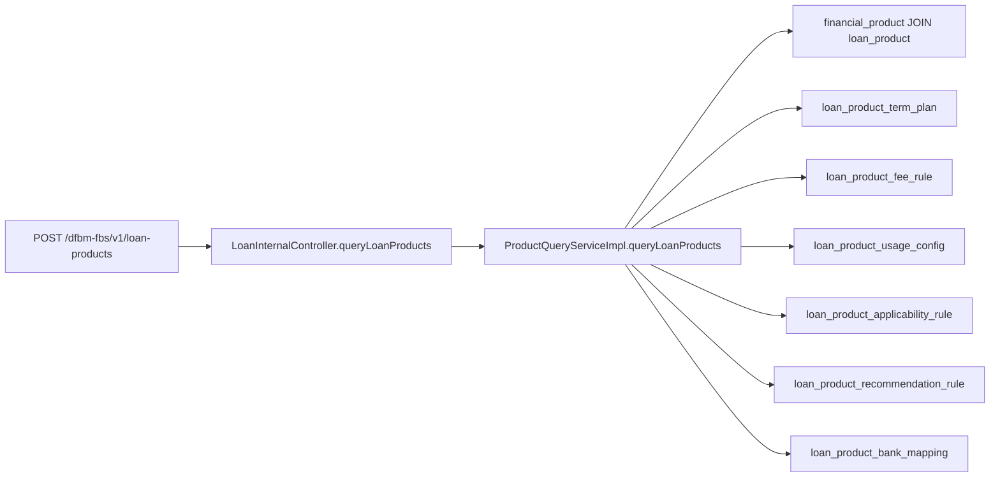

# 黄金用例：01100121 贷款产品查询

## 1. 用例目标

验证 BankDev Agent 能否从接口号出发，准确找到当前代码入口、业务处理和数据库读取关系，并在没有静态证据时拒绝生成 DCIS/Fineract 调用边。

本用例固定到：

- DFBM：`44f59fabb2235f612fc470b49b18a0d551a9b995`
- DCIS：`350fbdae3506f79bc1a1cf99afeb7f32680db415`
- Fineract：`d5636847ac556c30b437254c353f05526d172b97`
- 知识库：`f2cfbada05011c0d0f15f607feb4826d254b2526`

知识库接口说明状态仍是“待审核；代码观察 + dev 实测”，并已按用户裁决和当前 DFBM 代码校正为 `POST /dfbm-fbs/v1/loan-products`。该更新已在知识库 commit `f2cfbad` 中提交并推送；Golden 同时锁定知识库 commit、证据文件 SHA-256 和行号。[知识库接口说明](/Users/god/Projects/mint/my_knowledge/bank-knowledge/02_knowledge/03_接口/01100121_贷款产品查询接口说明_2026-09-29.md:1)

## 2. 当前已确认静态事实

### 接口契约

- 接口号：`01100121`
- HTTP：`POST /dfbm-fbs/v1/loan-products`
- OpenAPI operation：`queryLoanProducts`
- 可选请求体：`LoanProductQueryRequest`，其中包含 `dfpIdList`
- 成功响应：`LoanProductList`

代码证据：[dfbm-fbs-api.yaml](/Users/god/Projects/mint/dfbm/mint-dfbm/dfbm-fbs/src/main/openapi/dfbm-fbs-api.yaml:621)。

### 入口与服务

`LoanInternalController.queryLoanProducts` 规范化请求体中的 `dfpIdList`，调用 `ProductQueryService.queryLoanProducts`，再把内部 VO 转为 OpenAPI 响应模型。

- [LoanInternalController.java:56](/Users/god/Projects/mint/dfbm/mint-dfbm/dfbm-fbs/src/main/java/com/wefi/dfbm/fbs/loan/controller/LoanInternalController.java:56)
- [ProductQueryService.java:10](/Users/god/Projects/mint/dfbm/mint-dfbm/dfbm-fbs/src/main/java/com/wefi/dfbm/fbs/product/service/ProductQueryService.java:10)
- [ProductQueryServiceImpl.java:114](/Users/god/Projects/mint/dfbm/mint-dfbm/dfbm-fbs/src/main/java/com/wefi/dfbm/fbs/product/service/impl/ProductQueryServiceImpl.java:114)

### 数据读取

服务首先读取贷款产品，再批量读取期限、费用、用途、适用性、推荐规则和银行产品映射。全局 `DENY` 规则会过滤产品，推荐规则取最小 rank。

SQL 证据：

- [LoanProductMapper.xml:4](/Users/god/Projects/mint/dfbm/mint-dfbm/dfbm-fbs/src/main/resources/mapper/LoanProductMapper.xml:4)
- [LoanTermPlanMapper.xml:4](/Users/god/Projects/mint/dfbm/mint-dfbm/dfbm-fbs/src/main/resources/mapper/LoanTermPlanMapper.xml:4)
- [LoanFeeRuleMapper.xml:4](/Users/god/Projects/mint/dfbm/mint-dfbm/dfbm-fbs/src/main/resources/mapper/LoanFeeRuleMapper.xml:4)
- [LoanUsageConfigMapper.xml:4](/Users/god/Projects/mint/dfbm/mint-dfbm/dfbm-fbs/src/main/resources/mapper/LoanUsageConfigMapper.xml:4)
- [LoanApplicabilityRuleMapper.xml:4](/Users/god/Projects/mint/dfbm/mint-dfbm/dfbm-fbs/src/main/resources/mapper/LoanApplicabilityRuleMapper.xml:4)
- [LoanRecommendRuleMapper.xml:4](/Users/god/Projects/mint/dfbm/mint-dfbm/dfbm-fbs/src/main/resources/mapper/LoanRecommendRuleMapper.xml:4)
- [LoanProductBankMappingMapper.xml:4](/Users/god/Projects/mint/dfbm/mint-dfbm/dfbm-fbs/src/main/resources/mapper/LoanProductBankMappingMapper.xml:4)

## 3. 负向证据与严格表述

当前 DFBM `product` 主源码包没有 Client/SAO/RestTemplate/WebClient/Feign 远程调用命中；`LoanInternalController` 的产品查询方法只调用本地 `ProductQueryService`。DCIS 与 Fineract 的 `src/main` 中也没有 `01100121`、旧路由或新路由命中。因此本用例的期望是：**不得输出已确认的 DFBM → DCIS 或 DFBM → Fineract 产品查询调用边**。同一个 Controller 中其他开户/客户查询方法确实调用 DCIS，分析器必须做到方法级区分，不能把类级依赖错误传播给产品查询方法。

这只证明在固定 commit、固定搜索范围和当前静态代码中未发现该调用。它不证明配置驱动、数据库任务、未索引模块、其他版本或运行环境绝对不存在相关数据同步。贷款产品未来应经 DCIS 对接是用户确认的目标/决策，不是这个查询请求当前已经跨系统调用的证据。

## 4. 验收标准

1. 输入 `01100121` 时，当前代码契约 Top-1 命中 `POST /dfbm-fbs/v1/loan-products`；知识文档返回相同契约，并注明它已提交在固定知识库 snapshot 中。
2. 返回 `LoanInternalController`、Service interface/implementation 和 7 个 Mapper/SQL 位置。
3. 确认边 precision 为 100%；不得把名称相似或知识库目标拓扑当成当前调用边。
4. 返回 7 张本地业务表以及 `financial_product`/`loan_product` 主查询关系。
5. 报告注明知识文档状态、已解决的契约冲突、四个 snapshot，以及 DFBM/DCIS/知识库的既有工作树变化或本机元数据。
6. 所有事实 claim 绑定代码或知识证据；“不存在下游”必须表述为限定范围内未发现。
7. 文件 hash 或 commit 变化时标记用例 stale，不静默沿用行号。

## 5. 明确禁止的结论

- “01100121 当前仍是 GET /internal/v1/loan-products。”
- “01100121 当前会调用 DCIS/Fineract 查询产品。”
- “Fineract 产品参数会在本次 HTTP 请求中实时返回。”
- “知识库待审核接口说明就是已上线生产契约。”
- “关键词未命中证明所有版本、配置和运行时都不存在相关链路。”
